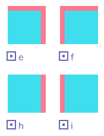
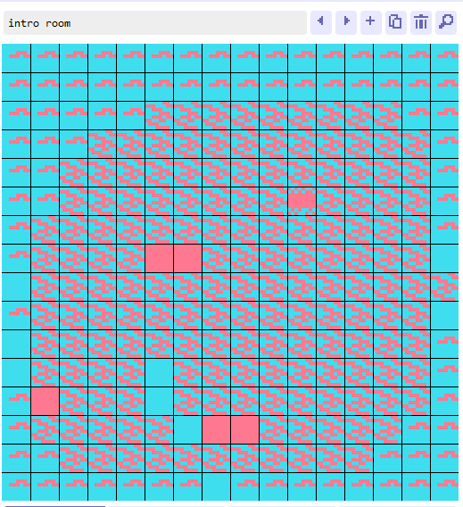
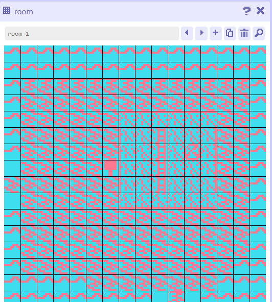

# April 21, 2025

## Catching up on Breakout

Being overconfident in my Unity skills, I skipped the Breakin' Out tutorial section so I am now spending time going through it to understand what was taught in that class (namely singletons).

## Exploration Prototype 3

For this prototype I would like to expand on my previous project and create a game of pool. There are some twists that I would like to apply in order to learn about timers, singletons, spawning children with different variables, and object rotation with quaternions. The idea is a normal game of pool except the balls only show their colours/point values when they have collided with other game objects, and then fade back to black. 

I have attempted to get the pool cue to rotate with the mouse but the position of the mouse is set to the entire world, not the local world. Doing some research, it appears Camera.ScreenToWorldPoint will work...and it does! That's a good feeling

----
Update: It's been about five days since I started working on this project and I think I need to call it quits on this one. I got very lost in the sauce attempting to figure out how to rotate the pool cue and then launch it. I don't exactly know what's happening here with the mouse movement, it wasn't rotating correctly though.

I then tried to learn rigidbodies and hinge joints which had their own set of issues, namely the cue not launching when i wanted it to. 

In hindsight, I may have been overambitious yet again. The rotation would have been nice, but it didn't have anything to do with singletons or spawning variables so spending all my time on that was a mistake (not to say I learned nothing). I still like the idea, so I'll be using the next exploration prototype as a redo of sorts. Thinking about it now..maybe I should just have made it so the ball was controlled directly, instead of the cue.

# April 14, 2025

I Decided to start using Obsidian to write down my journals, this app rules! 
## Catching up on classes (put genuinely not intended)
Starting this journal by stating that reread through [Chapter 26 of IGDPAD](https://learning-oreilly-com.lib-ezproxy.concordia.ca/library/view/introduction-to-game/9780136619918/ch26.xhtml#ch20lev1sec7), and some of [Chapter 27](). I wanted to refresh myself on classes in C# and realized I had last opened the Boids project from Chapter 27 about a month ago... At the time I understood *most* of the text but was very confused at why the author had to create two instances of the boidSettings class. I now understand it was because you can't set static variables in the inspector (which I read before but never clicked until now). I still have more questions about serialization, why the class is able to be accessed without a constructor, and why `this.GameObject.GetComponent<>` is the same as `GetComponent<>`but I have to put that on the back burner for now.

## Exploration Prototype 2

### Process

For this prototype I believe a simple way to explore physics, scoring and tags would be to create a simple shuffleboard game (in 2D). At the time of writing (before starting), I believe what I need to accomplish is the following
- Create a disc with friction that charges up it's force while the mouse is held down
- Create multiple target zones (with tags?), detect what zone the disc is in
- Score points and reset
I realize this is quite similar to Pawng but I don't intend to reuse much code from that class lesson.

I attempted to do friction from the top down but that didn't exactly work because it would either a) push the board or b) go right over it. Reddit posts I found suggested simply slowing down the velocity over time and that made sense. 

---
Well that kind of worked! It's honestly quite boring but it works so there's that. The big issue I ran into was getting the zones to work since the disc could overlap into multiple ones at the same time (e.g. medium and hard difficulty). When this occurred it appeared to be a coin toss for what Unity decided. I'm sure there's a proper solution to this problem but I'm already getting lost in trying to solve this so I need to stop and be okay with it not working perfect. My duct tape solution is to reduce the size of the puck so that the odds of overlapping are reduced.

Image: I implemented a switch case which felt nice, a lot cleaner than a bunch of if statements 

GIF: "Finished" Game

### Reflection

While this was a decent way to get to grips with Unity, I'm realizing that this exploration was more of a technical exercise than a creative one. I'm very much not pushing the limits of game design by recreating shuffleboard. Still, I'm glad I decided to create something from scratch instead of reusing a template. One important lesson I learned from this exploration was understanding that it's possible for me to create  a smaller scoped project and feel fine with it. I purposely stopped myself from spending too much time and getting too attached. While that may be creatively unfulfilling (and is something I can work on balancing), it feels nice to have a small project completed for once in my life. Future iterations of this shuffleboard game could include multiplayer, fixed collision detection and UI elements. Future exercises could be improved by setting creative and technical goals.

# March 20, 2025
Starting this off by mentioning I'm going to be writing multiple entries per week, and am now starting off with specific dates (e.g. "March 20, 2025") rather than "Week 1", "Week 2" etc. There is a lot of catching up I have to do and it's easier to sporadically write entries than have to figure out the math of "Week 8.17" etc.

## Where I've been
Here's the rundown of where I've been so far: The first week or so of this course was fine, but afterwards up until mid-February I was quite busy with a class from the previous semester I had received an extension for (CART 351). It consumed most of my time trying to wrap everything up and once that was done I had taken the week off for myself, as of a reward for having that weight off my shoulders. From there it was reading week, which I was pretty busy most of the time (though I did squeeze in a good amount of playing Keep Driving) Early March I had planned to start a big catch-up in this course, and just my luck...I caught the flu (so I was out for a week). Now..finally it's March 20th and the catch-up truly begins now. I had struggled to read the textbook but recently made a commitment to getting through it a short while ago and have been making steady progress. I am currently finished chapter 28, and have to get through chapter 25 (Debugging) & chapter 7 (Acting Like a Designer). 
There's also ADHD stuff I'm working through and that's been a whole thing. There's a fine line of mental health issues taking over my life and things genuinely being my fault and I don't know which side of that line I'm on (is that the right metaphor?)
 
## Exploration Prototype #1

### Concept
As someone who has had issues with scope and figuring out an idea that I won't get lost in for weeks, I decided to cheat and use a tip taught later in the course: brain dumping. I gave myself a two minute timer, and generated the following ideas on how to tweak the fallingAsleep project:
- Bounce balls back up
- Change color of paddle to ball
- Spawn balls from all sides, dodge
- Spawn pellets you have to collect (pac-man)
- Physics simulation, drop ball along slopes and the ball changes color
- Push block into goal (sokoban)
- Sort colours into blocks (Mario party)

I decided on the last idea, which was actually *not* from Mario Party, but from Wii Fit Plus (deep pull I know). The image below is a screenshot from the game. It's pretty simple, you just tilt a paddle to sort the colour of the ball into the matching pipe. What makes it tricky in the Wii U game is you have to tilt the balance board but I digress... 

(Image from wiikipedia.fandom.com/wiki/Tilt_City)
### Process

I started off by rotating the paddle around in place with the arrow keys

TEMP MP4 LINK: https://imgur.com/a/4fV9tC1

Then I changed the ball dropper to randomly assign a ball a "left" or "right" tag and change the colour depending on which tag it had. From there it was as simple as creating two box colliders and adding tags to them as well, then checking if they matched through C# code. If they did, the score would increase. Easy, right?

Because I'm smart, I decided to attach the *global* score values to the *instanced* balls. For some random reason that was totally not my fault, they were only logging their individual scores, hence I was just getting -1s or +1s.

To fix this, instead of creating two separate box colliders, I would have one large box collider and then just check what side each ball was on. Instead of assigning a score to an instanced ball, I would instead assign a global score to just this one one box collider. I know hard coding isn't great...but it works, and for the first exploration that's good enough!

It works! Not sure why imgur is adding all these dots though so just ignore that 

# Week 1.5 - Explore Unity
Going to be honest, this was a stressful week! A lot going on with other courses and life(tm) made it difficult to get any work done. I have nothing to show for today * but * hopefully this evening or tomorrow a Week 2 post will appear of me actually doing this week's assignment. I should note that I do take a bit of accountability for pushing this week's work off til the last minute, one of these days I'll fix that...

# Week 1 - Make A Thing
I was surprised at how much using Bitsy was an exercise in frustration. While the focus of the platform is on how restricted your toolset is, the lack of quality of life features felt like an oversight rather than an intentional decision. Having no option to rotate tiles meant that what could have been a quick one and done process became a task I had to repeat four times, which also took away from productivity as I had to sort through three duplicate tiles in my tileset.

 *Two of the same tiles "rotated" are really just two seperately drawn tiles*

</img>

In addition, the platform was significantly glitchier than I had expected. Tiles would randomly swap with each other, the game would occasionally appear to have reverted to the default template, and more. This became a struggle against the system, instead of with it.

*The tiles were not updating, giving the appearance that nothing changed. On reload, the random clicks I had made suddenly displayed*

  

My procrastination meant that I had put off the project until the last minute, so I had to make something quick and scrappy. I wished I had a bit more “gameplay” instead of walking around and clicking on sprites but even still, there were some keen observations I had noticed through playtesting. The first is that while I had thought it would be best to make the avatar and background sprites the same colour for consistency, it was surprisingly hard to tell the two apart. In addition, I should have been more careful with the tile size limits. Representing a beach with a volleyball court could be done, but I was a little too sloppy with the pixel art and as a result players had a hard time telling what was what. In addition, there was the expectation that players could enter said volleyball court, which I intentionally made not the case. In the future I should do a better job communicating what is interactable and what is not.

*This volleyball court isn't actually explorable*

  
